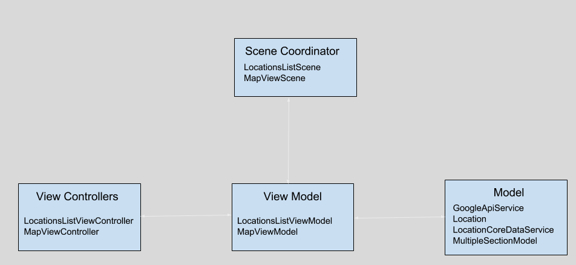

## Architecture Overview
This app uses MVVM + Coordinator pattern and RxSwift for functional reactive programming.
###### Advantages of MVVM + C architecture

1. MVVM pattern helps to maintain the the viewcontroller light weight.
2. MVVM helps to acheive better separation of concerns.
3. Helps to improve the testability.

###### Architecture Diagram

1. Viewcontroller is bindable type, so all the UI elements in the viewcontroller are binded with the viewmodel.
2. Viewcontroller listens for the changes that occur in the viewmodel.
3. Viewmodel talks with the model and updates the viewcontroller through Observable.
4. Model is responsible for making api call, core data operation and acts as a data store.
5. Scene is a screen managed by a viewcontroller. It comprises a viewcontroller and view model.
6. Transition between different scene (viewcontroller + viewmodel) happens through scene coordinator.

###### List of third party libraries used
1. RxSwift (https://github.com/ReactiveX/RxSwift)
    * Used to acheieve functional reactive programming.
2. RxCocoa (https://github.com/ReactiveX/RxSwift/tree/master/RxCocoa)
  - Used to acheieve functional reactive programming.
3. RxDataSource (https://github.com/RxSwiftCommunity/RxDataSources)
  - Used to show reactive tableview with multiple sections.
4. RxMapView (https://github.com/RxSwiftCommunity/RxMKMapView)
  - Rx extension for MapKit framework.
5. Moya (https://github.com/Moya/Moya)
 - Network abstration layer.
6. SwiftyJson (https://github.com/SwiftyJSON/SwiftyJSON)
 - For wasy json parsing
7. RxBlocking (https://github.com/ReactiveX/RxSwift/tree/master/RxBlocking)
  - For unit testing async code.

###### Things that can be improved
1. I would like to organize the unit test code. I havent checked for any code duplication for unit tests.
2. I would like to add activity indicator while location search is being peformed.
3. Error handling can be improved. Now the code will show "No Results" message for all the errors, it is better to show a specific error message. For e.g when there is no network connection, instead of showing "No Results" message i like to show "No Internet connection" message.
4. UI testing and perfomance testing can be done.
5. For the custom back button that i am using in the MapViewController dose not have back button icon, it has just "back" text. I need to set a back button image. 

###### Things not delivered
1. Core data model is not unit tested due to lack of time.

###### Additional comments
1. I thought it would be nice to search the location as user types in the search bar. So i haven't enable the search bar action, it can be enabled if needed.
